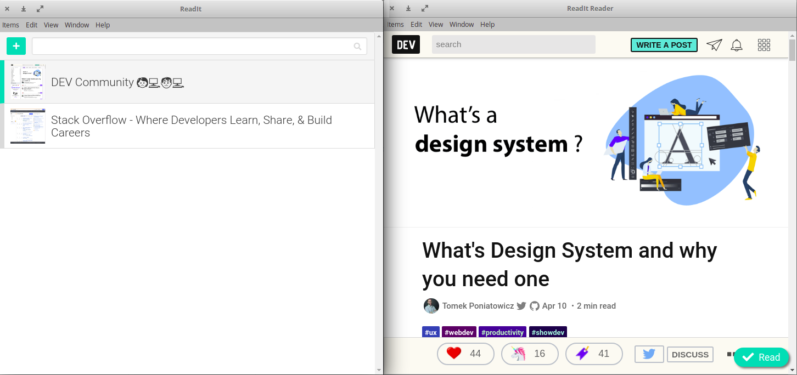

## Work from Udemy course "Master Electron: Desktop Apps using HTML, JavaScript & CSS"

#### This repository hosts all my work completed while taking this udemy course: https://www.udemy.com/master-electron/. 

#### Throughout the course you:

* Learn to develop with Electron using the best tools
* Understand the different parts of Electron and how they work together
* Cover the near-entire Electron API, learning one module at a time
* Learn Electron features & techniques for using API modules together
* Put your new knowledge to practical use by building a detailed 8-step Electron project from scratch.

#### It's a great course and I highly recommend it!

### Below is a screenshot of the project you build throughout the course. It's a great first Electron project to introduce you to all the essentials.

